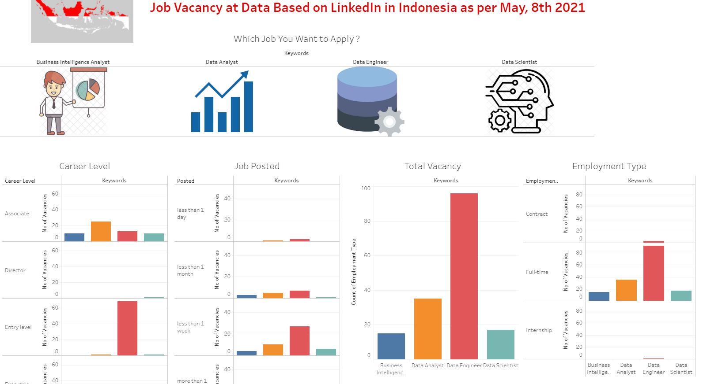

# LinkedIn Job Vacancy Web Scraping

#### This project used for somebody who is looking for a job in the data industry and want to seek for what happen in the industry, especially in Indonesia 

Step processing :
1. Use Selenium to scrap the data from <a href='https://linkedin.com'>LinkedIn</a> 
2. In this case, I will search these jobs:
- Senior Data Engineer / Data Engineer
- Senior Data Scientist / Data Scientist
- Senior Data Analyst / Data Analyst
- Senior Business Intelligence / Business Intelligence Analyst
3. Scrap some important informations, such as :
- Job Company
- Job Posting Time
- Career Level
- Size of Company
- Company Industry
- Detail Description
- Employment Type
- Job Function
4. Put these information into dataframe
5. Try to visualize it using Tableau

How to run this :
1. Install Selenium library from cmd prompt type '-pip install Selenium'
2. Download Chrome from <a href='https://chromedriver.chromium.org/'>here</a>. Make sure to download the version that match your browser
3. Run the Jupyter ipynb file. See the #The explanation each step included inside (in Bahasa) 
4. Input your LinkedIn username and password
5. Enter the keyword that you want to search 
6. You will find output as csv file included the item in no (3) at step processing

After that, I try to visualize it and to find some new insight. 
Here is the result : 
It is an interactive dashboard that visualize the data from the scrap project  
Please check the dashboard in <a href='https://public.tableau.com/profile/johan.klemantan.widagdo#!/vizhome/LinkedInJobVacancyAboutDatainIndonesia/Dashboard1?publish=yes'>My Tableau Profile here</a>   
 
- From the dashboard, Data Engineer has the most job vacancy open, compared to the other job in Data Industry.
- Also, for job level Entry Level, Data Engineer is also the most popular job to be searched for now, in Indonesia
### Thankyou & Happy Coding
